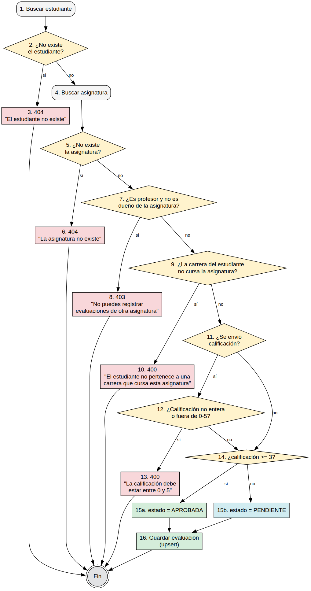

# Pruebas de software

Diseño de casos de prueba de caja negra, caja blanca e integración, aplicados a una muestra representativa del sistema. Pensado para copiar directo al informe de tesis; las capturas de pantalla y la columna "Resultado obtenido" se completan al ejecutar cada caso sobre la aplicación corriendo.

**Muestra elegida y por qué:**
- **Caja negra:** formulario "Nuevo estudiante" (`/vicedecana/estudiantes`). Se eligió porque es el formulario con más variedad de campos y reglas de validación del sistema (texto obligatorio, correo, contraseña con longitud mínima, selects dependientes de datos, unicidad validada en servidor).
- **Caja blanca:** método `registrar()` de `EvaluacionesService` (`backend/src/evaluaciones/evaluaciones.service.ts`). Se eligió porque concentra la regla de negocio central del sistema (determinar automáticamente si una evaluación queda Aprobada o Pendiente) y tiene suficientes decisiones para un análisis de complejidad ciclomática con sentido.
- **Integración:** flujo completo de registrar una evaluación pendiente y verla reflejada en los reportes y el dashboard de la vicedecana.

---

## 1. Prueba de caja negra — formulario "Nuevo estudiante"

### 1.1 Reglas de validación

| Campo | Regla en el formulario (cliente) | Regla adicional en el servidor |
|---|---|---|
| Nombre | Obligatorio | — |
| Apellidos | Obligatorio | — |
| Correo | Obligatorio, formato de correo válido | Debe ser único (no puede existir otro usuario con el mismo correo) |
| Contraseña | Obligatoria, mínimo 6 caracteres | — |
| Carrera | Obligatorio seleccionar una opción | Debe existir en la base de datos |
| Carné de identidad | Obligatorio | Debe ser único (no puede existir otro estudiante con el mismo carné) |
| Municipio | Obligatorio (viene preseleccionado) | — |
| Teléfono | Opcional | — |

### 1.2 Clases de equivalencia

| Campo | Clases válidas | Clases inválidas |
|---|---|---|
| Nombre / Apellidos | Cadena no vacía | Cadena vacía |
| Correo | Formato `texto@dominio.tld`, no registrado | Vacío · formato incorrecto (sin `@`, sin dominio) · ya registrado |
| Contraseña | Longitud ≥ 6 | Vacía · longitud 1–5 (valor límite: 5 inválido / 6 válido) |
| Carrera | Una opción seleccionada | Sin seleccionar (`""`) |
| Carné de identidad | Cadena no vacía y no registrada | Vacía · ya registrada por otro estudiante |
| Municipio | Cualquiera de las 8 opciones | (no aplica, siempre trae un valor por defecto) |

### 1.3 Casos de prueba

| # | Objetivo | Datos de entrada | Resultado esperado | Resultado obtenido |
|---|---|---|---|---|
| CN-01 | Alta exitosa con todos los datos válidos | Nombre `Yusnier`, Apellidos `Ramos`, correo `yusnier.ramos@ucf.edu.cu`, contraseña `Clave123`, carrera `Ingeniería Informática`, carné `99012345678`, municipio `Cienfuegos`, teléfono vacío | Se cierra el diálogo, aparece el toast "Estudiante creado" y la fila nueva en la tabla | ☐ Pendiente |
| CN-02 | Nombre vacío | Dejar "Nombre" en blanco y enviar | Mensaje "El nombre es obligatorio" debajo del campo; no se envía la petición | ☐ Pendiente |
| CN-03 | Correo con formato inválido | Correo `yusnier-arroba-mal` | Mensaje "Correo inválido"; no se envía la petición | ☐ Pendiente |
| CN-04 | Contraseña por debajo del límite (valor límite inválido) | Contraseña de 5 caracteres, ej. `Cla12` | Mensaje "La contraseña debe tener al menos 6 caracteres" | ☐ Pendiente |
| CN-05 | Contraseña en el límite válido | Contraseña de exactamente 6 caracteres, ej. `Cla123` | Formulario acepta el campo (sin error de longitud) | ☐ Pendiente |
| CN-06 | Carrera sin seleccionar | Dejar el select de carrera en "Seleccione una carrera…" | Mensaje "Seleccione una carrera"; no se envía la petición | ☐ Pendiente |
| CN-07 | Carné de identidad vacío | Dejar "Carné de identidad" en blanco | Mensaje "El carné de identidad es obligatorio" | ☐ Pendiente |
| CN-08 | Correo ya registrado (validación de servidor) | Usar un correo que ya exista, ej. `estudiante@ucf.edu.cu` | El formulario pasa la validación de cliente, pero el servidor responde 400 y se muestra "El correo ya existe" en el recuadro rojo del formulario | ☐ Pendiente |
| CN-09 | Carné ya registrado (validación de servidor) | Correo nuevo, pero carné `0102030405` (ya usado por María García en el seed) | El servidor responde 400 y se muestra "El carné de identidad ya está registrado" | ☐ Pendiente |
| CN-10 | Teléfono vacío (campo opcional) | Dejar "Teléfono" en blanco, resto de campos válidos | El alta se completa sin pedir el teléfono | ☐ Pendiente |

> Para las capturas: CN-01 y CN-10 se ilustran con la tabla actualizada y el toast de éxito; CN-02 a CN-07 con el mensaje de error debajo del campo antes de enviar; CN-08 y CN-09 con el recuadro rojo de error de servidor dentro del diálogo (ese es el que distingue una validación de cliente de una de servidor, vale la pena resaltarlo en el informe).

---

## 2. Prueba de caja blanca — `EvaluacionesService.registrar()`

El método `registrar()` es el que se ejecuta cuando un profesor califica a un estudiante en una de sus asignaturas: recibe el identificador del estudiante, el de la asignatura, la calificación (0 a 5) y una observación opcional, y guarda esa información como una evaluación. Si el estudiante ya tenía una evaluación registrada en esa asignatura, la actualiza en lugar de crear una nueva (es una operación de tipo *upsert*); por eso el mismo método atiende tanto el alta como la modificación de una evaluación. Antes de guardar, valida que el estudiante y la asignatura existan, que el profesor tenga permiso sobre esa asignatura, que la carrera del estudiante corresponda a una de las que cursa la asignatura y que la calificación esté en el rango permitido; y calcula automáticamente el estado de la evaluación (Aprobada si la calificación es 3 o más, Pendiente en caso contrario).

### 2.1 Código analizado

```ts
async registrar(dto: {
  estudianteId: string;
  asignaturaId: string;
  calificacion?: number | null;
  fecha?: Date;
}, usuarioActual?: any) {
  const estudiante = await this.prisma.estudiante.findUnique({           // 1
    where: { id: dto.estudianteId },
    include: { usuario: true },
  });

  if (!estudiante) {                                                     // 2
    throw new NotFoundException('El estudiante no existe');              // 3
  }

  const asignatura = await this.prisma.asignatura.findUnique({           // 4
    where: { id: dto.asignaturaId },
    include: { profesor: true, carreras: { select: { id: true } } },
  });

  if (!asignatura) {                                                     // 5
    throw new NotFoundException('La asignatura no existe');              // 6
  }

  if (                                                                   // 7
    usuarioActual &&
    usuarioActual.rol === 'PROFESOR' &&
    asignatura.profesor.usuarioId !== usuarioActual.id
  ) {
    throw new ForbiddenException('No puedes registrar evaluaciones de otra asignatura'); // 8
  }

  if (!asignatura.carreras.some((carrera) => carrera.id === estudiante.carreraId)) {  // 9
    throw new BadRequestException(                                                    // 10
      'El estudiante no pertenece a una carrera que cursa esta asignatura',
    );
  }

  if (dto.calificacion !== undefined && dto.calificacion !== null) {     // 11
    if (!Number.isInteger(dto.calificacion) || dto.calificacion < 0 || dto.calificacion > 5) { // 12
      throw new BadRequestException('La calificación debe estar entre 0 y 5');            // 13
    }
  }

  const calificacion = dto.calificacion ?? null;
  const estado: 'APROBADA' | 'PENDIENTE' =
    calificacion !== null && calificacion >= 3 ? 'APROBADA' : 'PENDIENTE'; // 14
  const data = { estudianteId: dto.estudianteId, asignaturaId: dto.asignaturaId, calificacion, estado, fecha: dto.fecha ?? new Date() };

  return this.prisma.evaluacion.upsert({                                 // 15
    where: { estudianteId_asignaturaId: { estudianteId: dto.estudianteId, asignaturaId: dto.asignaturaId } },
    update: { calificacion: data.calificacion, estado: data.estado, fecha: data.fecha },
    create: data,
    include: { estudiante: { include: { usuario: true, carrera: true } }, asignatura: { include: { profesor: { include: { usuario: true } } } } },
  });
}
```

Se identifican **7 puntos de decisión**: dos validaciones de existencia (líneas 2 y 5), una validación de permisos del profesor (línea 7), una validación de que la carrera del estudiante cursa la asignatura (línea 9), una validación de rango de la calificación (líneas 11 y 12) y el cálculo del estado final (línea 14, una expresión condicional que decide entre `APROBADA` y `PENDIENTE`).

### 2.2 Grafo de flujo



El código fuente del diagrama está en `docs/diagramas/`, en dos formatos por si querés editarlo o regenerarlo:

- **`registrar-evaluacion.dot`** (Graphviz) — es el que generó la imagen de arriba. Para volver a renderizarlo: pegalo en [dreampuff.github.io/GraphvizOnline](https://dreampuff.github.io/GraphvizOnline/) o corré `dot -Tpng registrar-evaluacion.dot -o registrar-evaluacion.png` si tenés Graphviz instalado (`sudo apt install graphviz`).
- **`registrar-evaluacion.puml`** (PlantUML) — la misma lógica pero como diagrama de actividad (flowchart clásico, con rombos de decisión). Para renderizarlo: pegalo en [plantuml.com/plantuml](https://www.plantuml.com/plantuml/uml/) o usá la extensión "PlantUML" de VS Code.

Cualquiera de las dos imágenes sirve para el informe; la del `.dot` es la que numera los nodos igual que la tabla de caminos básicos de abajo (1 a 16 + Fin).

### 2.3 Complejidad ciclomática

Con 7 puntos de decisión: **V(G) = número de decisiones + 1 = 8**.

Verificación por el grafo (nodos y aristas contando un nodo "Fin" común donde convergen las 6 salidas: las 5 excepciones y el flujo normal): V(G) = aristas − nodos + 2 = 24 − 18 + 2 = **8**. Coincide con el cálculo anterior.

### 2.4 Caminos básicos (independientes)

| Camino | Recorrido | Condición que lo dispara |
|---|---|---|
| C1 | 1→2(no)→3→Fin | El estudiante no existe |
| C2 | 1→2(sí)→4→5(no)→6→Fin | La asignatura no existe |
| C3 | 1→2→4→5(sí)→7(no)→8→Fin | Un profesor intenta evaluar una asignatura que no es suya |
| C4 | 1→2→4→5→7(sí)→9(no)→10→Fin | La carrera del estudiante no cursa la asignatura |
| C5 | 1→2→4→5→7→9(sí)→11(sí)→12(no)→13→Fin | La calificación está fuera de 0-5 o no es entera |
| C6 | 1→2→4→5→7→9→11(sí)→12(sí)→14(sí)→15a→16→Fin | Calificación válida y ≥ 3 → se guarda como Aprobada |
| C7 | 1→2→4→5→7→9→11(sí)→12(sí)→14(no)→15b→16→Fin | Calificación válida y < 3 → se guarda como Pendiente |
| C8 | 1→2→4→5→7→9→11(no)→14(no)→15b→16→Fin | No se envía calificación → se guarda como Pendiente sin nota |

### 2.5 Casos de prueba por camino básico

| Caso | Camino | Entrada | Resultado esperado | Resultado obtenido |
|---|---|---|---|---|
| CB-01 | C1 | `estudianteId` de un UUID que no existe | `404 Not Found` — "El estudiante no existe" | ☐ Pendiente |
| CB-02 | C2 | `estudianteId` válido + `asignaturaId` que no existe | `404 Not Found` — "La asignatura no existe" | ☐ Pendiente |
| CB-03 | C3 | Autenticado como `profesor@ucf.edu.cu`, `asignaturaId` de una asignatura de **otro** profesor | `403 Forbidden` — "No puedes registrar evaluaciones de otra asignatura" | ☐ Pendiente |
| CB-04 | C4 | Asignatura propia + estudiante de una carrera que **no** cursa esa asignatura (ej. estudiante de Civil en *Introducción a la Programación*, que es solo de Informática) | `400 Bad Request` — "El estudiante no pertenece a una carrera que cursa esta asignatura" | ☐ Pendiente |
| CB-05 | C5 | Estudiante de una carrera de la asignatura + `calificacion: 7` (o `-1`, o `3.5`) | `400 Bad Request` — "La calificación debe estar entre 0 y 5" | ☐ Pendiente |
| CB-06 | C6 | Estudiante de una carrera de la asignatura + `calificacion: 4` | `201/200`, `estado: "APROBADA"` | ☐ Pendiente |
| CB-07 | C7 | Estudiante de una carrera de la asignatura + `calificacion: 1` | `201/200`, `estado: "PENDIENTE"`, `calificacion: 1` | ☐ Pendiente |
| CB-08 | C8 | Estudiante de una carrera de la asignatura + `calificacion: null` (o el campo omitido) | `201/200`, `estado: "PENDIENTE"`, `calificacion: null` | ☐ Pendiente |

Estos 8 casos dan **cobertura del 100% de las decisiones y de los caminos básicos** del método.

> Para CB-03 hace falta una segunda asignatura a cargo de otro profesor: como admin, crear un usuario con rol Profesor y, en *Asignaturas*, una asignatura a su cargo. Luego intentar registrar la evaluación autenticado con `profesor@ucf.edu.cu` (dueño de otra asignatura) contra esa asignatura ajena.
>
> Para CB-04 hace falta un estudiante de una carrera distinta a las de la asignatura (con el seed: un estudiante de Ingeniería Civil contra *Introducción a la Programación*). Los casos CB-05 a CB-08 se ejecutan con un estudiante de una carrera que sí cursa la asignatura (ej. Informática).

---

## 3. Prueba de integración — camino más corto (ruta feliz)

Objetivo: comprobar que las cuatro capas del sistema (alta de estudiante, registro de evaluación, filtro de pendientes/reportes y resumen del dashboard) trabajan juntas correctamente, siguiendo la ruta más corta posible sin casos alternativos.

**Precondición:** usuarios de prueba del seed (`docs/instalacion.md`): `vicedecana@ucf.edu.cu` / `Vice123!` y `profesor@ucf.edu.cu` / `Profesor123!`.

| Paso | Quién | Acción | Resultado esperado |
|---|---|---|---|
| 1 | Vicedecana | Entra a *Estudiantes* → *Nuevo estudiante* → completa el alta (ver CN-01) | El estudiante aparece en la tabla |
| 2 | Vicedecana | Anota el dashboard (`/vicedecana`): cuenta de "Estudiantes" | El contador subió en 1 respecto al paso anterior |
| 3 | Profesor | Entra a *Mis Asignaturas* → una asignatura **que cursa la carrera del estudiante creado en el paso 1** → busca al estudiante y le pone una nota menor a 3 (ej. `2`) | La fila muestra "Pendiente" inmediatamente; el estudiante aparece porque su carrera es una de las de la asignatura |
| 4 | Vicedecana | Entra a *Pendientes* | El estudiante aparece en la lista, sin necesidad de aplicar ningún filtro |
| 5 | Vicedecana | Entra a *Reportes* y filtra por Estado = Pendiente | Aparece la misma evaluación que en el paso 4 |
| 6 | Vicedecana | Vuelve al dashboard (`/vicedecana`) | El contador de "Evaluaciones pendientes" subió en 1 |
| 7 | Estudiante | El propio estudiante inicia sesión con la cuenta creada en el paso 1 | Ve su evaluación como "Pendiente" en *Mi Perfil* |

Si los 7 pasos se cumplen en orden, queda demostrado que la creación de estudiante, el registro de evaluaciones, los filtros de reportes/pendientes y el dashboard leen todos la misma fuente de datos de forma consistente — es la ruta más corta que atraviesa los cuatro roles del sistema.

---

## 4. Resumen

| Tipo de prueba | Técnica | Casos diseñados | Cobertura |
|---|---|---|---|
| Caja negra | Partición en clases de equivalencia + valores límite | 10 (formulario "Nuevo estudiante") | Todas las reglas de validación de cliente y de servidor del formulario |
| Caja blanca | Caminos básicos (complejidad ciclomática de McCabe, V(G) = 8) | 8 (`EvaluacionesService.registrar()`) | 100% de decisiones y caminos del método |
| Integración | Camino más corto (ruta feliz) | 1 escenario de 7 pasos | Alta de estudiante → evaluación → pendientes/reportes → dashboard → autoconsulta |
